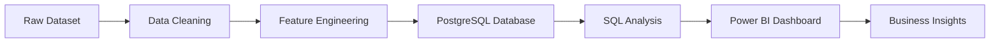

# 🛍️ Customer Shopping Behavior Analysis

<div align="center">


### 📊 End-to-End Data Analytics Project

*Transforming raw customer transaction data into actionable business insights using Python, SQL, PostgreSQL, and Power BI.*

</div>

---

## 📌 Project Overview

This project analyzes customer shopping behavior using **3,900+ customer transactions** to uncover valuable insights about purchasing patterns, customer segments, subscription behavior, and product performance.

The project follows a complete Data Analytics workflow:



---

## 🎯 Business Objectives

✔ Understand customer purchasing behavior

✔ Identify high-value customer segments

✔ Analyze subscription effectiveness

✔ Discover top-performing products

✔ Evaluate discount impact on sales

✔ Generate actionable business recommendations

---

## 🛠️ Tech Stack

| Tool             | Purpose                 |
| ---------------- | ----------------------- |
| Python           | Data Cleaning & EDA     |
| Pandas           | Data Manipulation       |
| NumPy            | Numerical Operations    |
| PostgreSQL       | Database Storage        |
| SQL              | Business Analysis       |
| Power BI         | Dashboard Development   |
| Jupyter Notebook | Development Environment |

---

## 📂 Dataset Information

### Dataset Statistics

| Metric         | Value                         |
| -------------- | ----------------------------- |
| Records        | 3,900                         |
| Features       | 18                            |
| Missing Values | 37                            |
| Categories     | Multiple                      |
| Customer Types | Subscribers & Non-Subscribers |

### Key Features

```text
Customer Details
├── Age
├── Gender
├── Location
└── Subscription Status

Purchase Details
├── Item Purchased
├── Category
├── Purchase Amount
├── Season
└── Shipping Type

Behavior Metrics
├── Review Rating
├── Previous Purchases
├── Discount Applied
└── Purchase Frequency
```

---

## 🧹 Data Cleaning & Preprocessing

### ✅ Missing Value Treatment

* Imputed missing review ratings using category-wise median.

### ✅ Feature Engineering

Created:

```python
age_group
purchase_frequency_days
```

### ✅ Column Standardization

```python
Purchase Amount (USD)
↓
purchase_amount
```

### ✅ Data Validation

* Removed redundant columns.
* Checked consistency across business fields.

---

## 📈 SQL Business Analysis

### Revenue Analysis

```sql
SELECT gender,
       SUM(purchase_amount)
FROM customer_behavior
GROUP BY gender;
```

### Customer Segmentation

```sql
CASE
WHEN previous_purchases = 0 THEN 'New'
WHEN previous_purchases <= 5 THEN 'Returning'
ELSE 'Loyal'
END
```

### Business Questions Answered

🔹 Revenue by Gender

🔹 High-Spending Discount Users

🔹 Top Rated Products

🔹 Subscription vs Non-Subscription Analysis

🔹 Revenue by Age Group

🔹 Product Category Performance

🔹 Customer Segmentation

🔹 Repeat Buyer Analysis

🔹 Shipping Behavior Analysis

🔹 Discount Dependency Analysis

---

## 📊 Dashboard Preview

### Power BI Dashboard Features

📌 KPI Cards

📌 Revenue Analysis

📌 Subscription Insights

📌 Category Performance

📌 Age Group Analysis

📌 Interactive Filters

📌 Customer Segmentation

> Add your dashboard screenshot here

```markdown

```

---

## 🔍 Key Insights

### 👥 Customer Insights

* Loyal customers account for the majority of transactions.
* Young adults generate the highest revenue.

### 🛒 Product Insights

* Gloves achieved the highest average rating.
* Clothing category generated the largest revenue.

### 💰 Revenue Insights

* Male customers generated more revenue.
* Express shipping users spend slightly more per purchase.

### 🎟️ Discount Insights

* Hats and Sneakers are highly dependent on discounts.

---

## 💡 Business Recommendations

### 🚀 Increase Subscription Adoption

Offer exclusive discounts and rewards.

### 🎯 Strengthen Customer Loyalty

Implement tier-based loyalty programs.

### 💰 Optimize Discount Strategy

Reduce over-reliance on discount-heavy products.

### 📢 Promote High-Rated Products

Feature top-rated products in marketing campaigns.

### 🎯 Target High-Revenue Segments

Focus on Young Adults and Loyal Customers.

---

## 📁 Project Structure

```bash
Customer-Shopping-Behavior-Analysis/
│
├── data/
│   └── customer_shopping_behavior.csv
│
├── notebooks/
│   └── Customer_Shopping_Behavior_Analysis.ipynb
│
├── sql/
│   └── customer_behavior_sql_queries.sql
│
├── dashboard/
│   └── Customer_Behavior_Dashboard.pbix
│
├── reports/
│   └── Customer Shopping Behavior Analysis.pdf
│
└── README.md
```

---

## 🚀 Future Enhancements

* Customer Lifetime Value (CLV)
* Churn Prediction
* Recommendation System
* Predictive Analytics
* Real-Time Dashboard

---

## 👨‍💻 Author

### Anil Sharma

🎓 B.Tech – Artificial Intelligence & Data Science

📧 [as3658349@gmail.com](mailto:as3658349@gmail.com)

📱 +91 8290502081

💼 Aspiring Data Analyst | Data Engineer | AI/ML Engineer

---

⭐ If you found this project useful, don't forget to star the repository!
